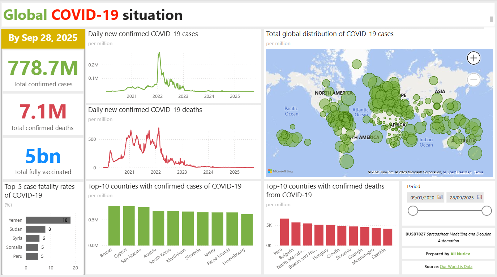

# COVID-19 Vaccination and Policy Analytics

**Identified the policy combination that minimises COVID-19 mortality without lockdowns — 0.02 deaths per million against a 0.61 global average, a 97% reduction — by modelling 11 Our World in Data tables into a five-page Power BI report and running a multivariate segmentation.**

Research question: *what combination of vaccination coverage and policy strictness minimises COVID-19 mortality while avoiding future lockdowns?*



📄 **[View the full report (PDF)](report/covid19-dashboard.pdf)** — all five pages, including the conclusions and policy recommendations.

---

## What I found

**1. Minimal restrictions are viable — but only under specific conditions.**

The optimal segment achieves an average daily death rate of **0.02 per million** while holding the stringency index at or below 10.8 — a ~97% reduction against the global average of 0.61. It requires four conditions holding simultaneously:

| Condition | Threshold |
|---|---|
| Policy stringency | ≤ 10.8 |
| Vaccination coverage | ≥ 58.64% fully vaccinated |
| GDP per capita | 8,073 – 13,531 (PPP adjusted) |
| Median age | ≤ 39.19 years |

**2. Median age is the binding constraint, not policy.**

Every segment that kept stringency at or below 10.8 *without* the supporting structural conditions incurred 0.29–0.40 deaths per million. The starkest case: populations with median age above 39.19 reached 0.36 per million under the same policy — an **18-fold increase** over the optimal segment. Low-restriction policy is not transferable to ageing populations without compensating measures.

**3. Vaccination decoupled case volume from healthcare burden.**

Before 2022, case counts and ICU admissions moved together. After widespread vaccination the two series diverge substantially and stay diverged. This is the empirical basis for arguing that population-wide lockdowns are no longer the necessary response to a case surge — the surge no longer translates into proportional hospital pressure.

**4. Scale of the intervention analysed.**

778.7M confirmed cases and 7.1M deaths globally as of 28 September 2025, against 13.72 billion doses administered and 5.20 billion people fully vaccinated.

---

## How I built it

**Data model.** 11 tables from [Our World in Data](https://ourworldindata.org/coronavirus), 2020–2025: six indicator tables (cases, deaths, case fatality rate, doses administered, people fully vaccinated), a consolidated country-day table carrying stringency index, GDP per capita, median age and ICU rates, a `Countries` dimension, and two tables holding the segmentation output.

**Segmentation.** Key Influencers analysis over four candidate drivers — vaccination rate, stringency index, GDP per capita and median age — to isolate which *combinations* move mortality, rather than assuming a single-variable relationship.

**Report design.** Five pages moving from global context to vaccination outcomes, then policy and healthcare impact, then recommendations — with cross-filtering, date hierarchies and country slicers scoped so that drilling into one country does not distort the global benchmark.

**Tech:** `Power BI` · `DAX` · `Power Query` · `Data modelling` · `Key Influencers`

---

## Repository

```
report/       PDF export and .pbit template
screenshots/  page previews
```

Source data is not included — it is public and updated continuously. Download the indicator CSVs from [Our World in Data](https://ourworldindata.org/coronavirus), then open `report/covid19-dashboard.pbit` in [Power BI Desktop](https://powerbi.microsoft.com/desktop/) and point it at your local folder. The template carries the full model, measures and visuals.

---

Individual assessment, BUSB7027 *Spreadsheet Modelling and Decision Automation* — MSc Business Analytics, University of Kent. Data licensed CC BY, Our World in Data.
